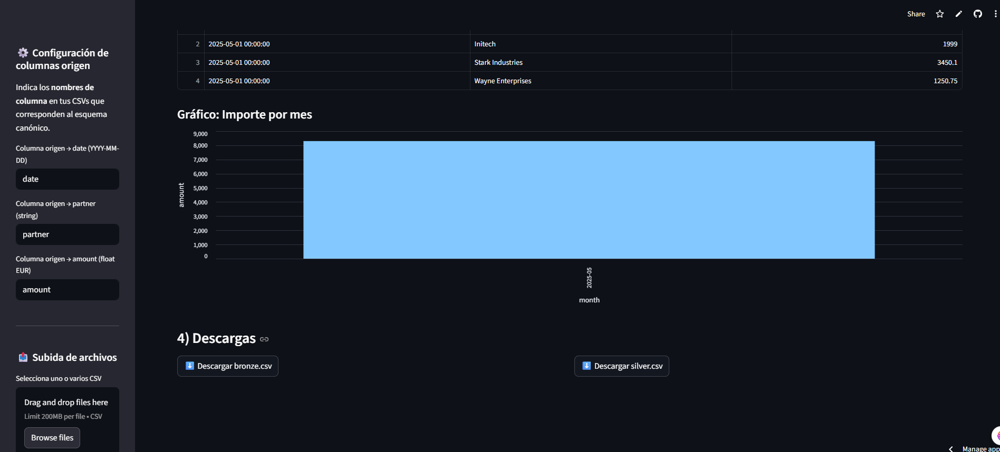

# De CSVs heterogéneos a un almacén analítico confiable  
**Repositorio:** `bigdata-storage-lab-<dedios>`

## Evidencia de funcionamiento

La app desplegada en Streamlit permite cargar CSVs, validarlos y derivar Bronze/Silver:

## 1. Objetivo

Diseñar y desplegar un flujo completo de datos que permita transformar **CSVs heterogéneos** en un **almacén analítico confiable**, siguiendo las etapas:

1. **Ingesta** de archivos CSV de distintas fuentes.  
2. **Validación** de esquemas, tipos de datos y reglas de calidad.  
3. **Normalización** y limpieza para unificar formatos y estructuras.  
4. Creación de capas **Bronze / Silver** dentro del flujo de almacenamiento.  
   - **Bronze:** datos crudos validados.  
   - **Silver:** datos limpios y estandarizados.  
5. Generación de **KPIs** clave en una aplicación interactiva (Streamlit).  

El objetivo es demostrar la capacidad de implementar un pipeline reproducible, trazable y documentado, desde datos crudos hasta visualizaciones útiles.

---

## 2. Entregables

- 📂 **Repositorio GitHub público** (`bigdata-storage-lab-<dedios>`) que incluya:  
  - Scripts de ingesta, validación y normalización.  
  - Estructura de carpetas (bronze, silver).  
  - Notebook(s) de prueba y ejemplos de ejecución.  
  - Documentación clara en Markdown.  

- 🖥️ **Aplicación Streamlit**:  
  - Lectura de datos desde la capa *Silver*.  
  - Cálculo de al menos **3 KPIs relevantes**.  
  - Visualización interactiva (tablas, gráficos, filtros).  

---

## 3. Criterios de Evaluación

1. **Diseño y justificación técnica**  
   - Claridad en la arquitectura del pipeline.  
   - Razonamiento detrás de elecciones tecnológicas y de modelado.  

2. **Calidad de datos**  
   - Reglas de validación implementadas.  
   - Manejo de valores nulos, duplicados, inconsistencias.  

3. **Trazabilidad y diseño del Data Warehouse**  
   - Evidencia clara de transición entre capas (Bronze → Silver).  
   - Organización modular y reproducible.  

4. **Documentación**  
   - README inicial completo.  
   - Guías de ejecución reproducibles.  
   - Comentarios adecuados en el código.  

---

## 4. Qué NO subir

🚫 **No incluir datos sensibles o privados**.  
- Usa datos sintéticos, abiertos o anonimizados.  
- No exponer credenciales, tokens ni configuraciones locales de seguridad.  

---

## 5. Tiempo estimado por fase

| Fase                          | Tiempo estimado |
|-------------------------------|-----------------|
| Ingesta de CSVs               | 2 h             |
| Validación de datos           | 3 h             |
| Normalización y limpieza      | 4 h             |
| Definición Bronze / Silver    | 3 h             |
| Desarrollo KPIs (Streamlit)   | 4 h             |
| Documentación y README final  | 2 h             |
| **Total**                     | **18 h aprox.** |

## 6. Decisiones de diseño (5V)

- **Volumen**: Los CSV son medianos → se procesan con pandas; se usan capas Bronze/Silver para manejar escalabilidad.
- **Velocidad**: Procesamiento batch en memoria; Streamlit da resultados inmediatos.
- **Variedad**: Los CSV traen columnas distintas → se usa un mapeo origen→canónico y normalización de fechas/amount.
- **Veracidad**: Validaciones implementadas (`basic_checks`), linaje (`source_file`, `ingested_at`).
- **Valor**: Agregación en Silver (partner × mes), KPIs y gráfico → insights claros.
## 7📝 Prompts de reflexión (con respuestas modelo)

1. **V dominante hoy y V dominante si 2× tráfico**  
   Hoy la **Variedad** es la V dominante: recibimos CSVs con columnas y formatos distintos que requieren normalización.  
   Si el tráfico se duplicara, la **Velocidad** sería dominante, porque el reto pasaría a ser procesar los archivos en menos tiempo sin colapsar la app.  
   La arquitectura tendría que optimizar el pipeline para mantener la experiencia fluida.

2. **Trade-off elegido (ej.: más compresión vs CPU)**  
   Se priorizó **guardar los CSV normalizados sin compresión**, para ahorrar CPU en la app y reducir la latencia al descargar.  
   El trade-off es ocupar más espacio en disco, pero mediremos este impacto revisando el tamaño acumulado de `/data/bronze` y `/data/silver`.  
   Si el crecimiento fuera excesivo, se evaluará un formato columnar (Parquet) con compresión ligera.

3. **Por qué “inmutable + linaje” mejora veracidad y qué coste añade**  
   Mantener los datos inmutables y con **linaje (`source_file`, `ingested_at`)** asegura que podemos auditar cualquier KPI hasta su origen.  
   Esto mejora la **veracidad**, porque cada cifra tiene trazabilidad completa.  
   El coste añadido es más almacenamiento (cada ingesta conserva duplicados) y mayor complejidad en la gestión de metadatos.

4. **KPI principal y SLA del dashboard**  
   - **KPI**: Total de ventas mensuales por partner.  
   - **SLA (latencia)**: actualización en menos de **1 minuto** tras subir un nuevo CSV.  
   - Esto habilita decisiones rápidas de negocio (ej. detectar partners más activos en el mes) y justifica que la latencia sea baja: la app debe ser interactiva, no batch.

5. **Riesgo principal del diseño y mitigación técnica concreta**  
   Riesgo: **errores de parseo en fechas/amount** al recibir CSVs con formatos inesperados.  
   Mitigación: usar `pd.to_datetime(errors="coerce")` y normalización de montos en `normalize_columns`, además de reportar validaciones fallidas en pantalla.  
   Con esto evitamos que un archivo corrupto bloquee el pipeline y damos feedback inmediato al usuario.

📌 **Recomendación:** trabajar por ramas (`feature/ingesta`, `feature/streamlit`, etc.) y hacer *pull requests* revisables.  

